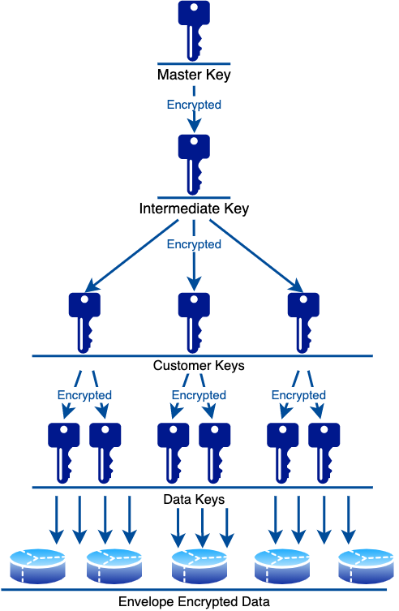

# Keyhouse Encryption

## Principles

Keyhouse is designed around all sensitive data being envelope encrypted, with the sole root key being stored in a HSM/similar hardware environment. In essence, we want our database to not be sensitive data, and pass off the sensitivity to the HSM/equivalent and the machines running Keyhouse with decrypted keys in memory.

Similarly, we want to avoid providing too much authority to connected clients, such that they must reconnect to Keyhouse and reload/get new keys in the future.

## Key Hierarchy

Keyhouse manages keys and uses key hierarchy to securely store them.

We use key hierarchy to help with several aspects:
- Minimize the amount of plaintext that needs to be protected. In keyhose, it is the master key, which is on top of the key hierarchy, and as long as it is protected, the underlying keys are protected inherently.
- Minimizes the amount of data encryption operations by producing a key and delegating it to the customer to protect the data with that key.
- Allows segmentation of the data that needs to be protected: keyhouse allows to have different keys with different authorization levels, purposes, and ACLs .

Operators can create customer keys and logically group them in keyrings. Customer keys are encrypted at rest with intermediate key, which, in turn, is also encrypted at rest with a master key that is typically stored in HSM and never leaves it. Normally, instance of a keyhouse needs to access HSM to decrypt the intermediate key once, at startup.

Keyhouse uses customer keys that never leave the system, to encrypt data keys that can typically be used by customers to encrypt the data, or internally - to protect secrets.

The following diagram illustrates the key hierarchy used by keyhouse:

## Key Types and Related Metadata

### Master Key

The master key *should* be stored in a hardware-secured environment with strict access controls. Network communication between the master key host and Keyhouse should as isolated as possible and authenticated in some form.

Keyhouse will request use of the master key on each instance's bootup, and again during intermediate key reloads, described below. In general, the master key *should not* be sent into Keyhouse, but rather the data to be encrypted/decrypted *should* be securely sent to the master key host.

Master key, by default, is AES-256-GCM.

#### Rotation
Master Key rotation is performed manually/via an external system. Keyhouse is pointed, via `master_key_id` configuration option, to a new master key in the master key implementation. Watchers within Keyhouse will see the updated key id, and begin an intermediate key rotation with the new master key.

### Intermediate Key

The intermediate key is in charge of encrypting all sensitive data owned by customer keys and is the only piece of data to be encrypted/decrypted by the master key.

By default, intermediate keys are rotated every 24 hours, signalling a re-encryption of all customer key sensitive data.

Intermediate keys are copied into each consumer (customer key), the intention being that customer key rotation can be safely sharded across a cluster of Keyhouse instances. This duplication allows us to rely on ETCDs/other storages consistency models to maintain our own consistency. As a result, it is impossible to have a customer key encrypted by a no-longer-existing intermediate key, since the customer key keeps track of it's own copy of the intermediate key.

Intermedaite keys, by default, are AES-256-GCM.

### Customer Key

Customer keys in Keyhouse are the primary unit of usage for end-users of Keyhouse. They own SPIFFE access control lists, information about generating data keys (see below), and encryption keys.

Customer keys's owned sensitive data does not leave Keyhouse, but serves as a last-stop before data leaves Keyhouse. They are the lowest level object kept track of by Keyhouse in an encryption flow.

Customer keys can be exclusively used to generate symmetric encryption data keys, or to encrypt secrets within Keyhouse. Thus, purpose of the key can be either encrypt/decrypt, or sign/verify.

Customer keys, by default, are AES-256-GCM.

### Data Key

Data keys in Keyhouse are the transient keys being sent from Keyhouse to SDKs for actually encrypting data. Upon request from the SDK, Keyhouse will send an encrypted and decrypted copy of the data key to the SDK. The decrypted key is used to encrypt some data and thrown away (in practicality, cached), and the encrypted key is stored alongside the encrypted data, along with some identifying metadata. 

Encrypted data key id data key with metadata AES-256-GCM encrypted with customer key with random constant IV.

Data keys are not stored by Keyhouse. They are generated in an (one-time-password) OTP-kind-of-approach by lazily-initialized thread-local random number generator seeded by the system, with the seed being part of the owning customer key, and encrypted at rest. By default, one data key rotation happens per day. In an ideal system, this would be a much shorter duration, however caching becomes much more demanding in SDKs if the number of data keys grows too quickly. Similarly, different clients would, in an ideal system, have different data keys. This is also not done for performance considerations. 

Data keys, by default, are AES-256-GCM.

#### Secrets

Secrets are encrypted by a data key at rest in Keyhouse, stored in the backend storage (i.e. ETCD). These serve as a convenience key-value store, with high read throughput and low write throughput guarantees. These are intended for high-value user-managed distributed secrets, such as HMAC secrets, private keys, sensitive credentials, etc.

They are represented as a binary blob, and the internal formatting is left to individual users discretion.

When a customer key is used to encrypt secrets, then its data keys do not leave Keyhouse.

#### Keyring

Keyring is a uniquely named logical customer key group, also serves as base unit for operator authorization.

#### Key Alias

Keyring-unique alias used to reference a specific Customer Key. Commonly prefixed with a keyring alias.

#### Key Id

A globally unique 32-bit identifier that internally represents a Customer Key.
